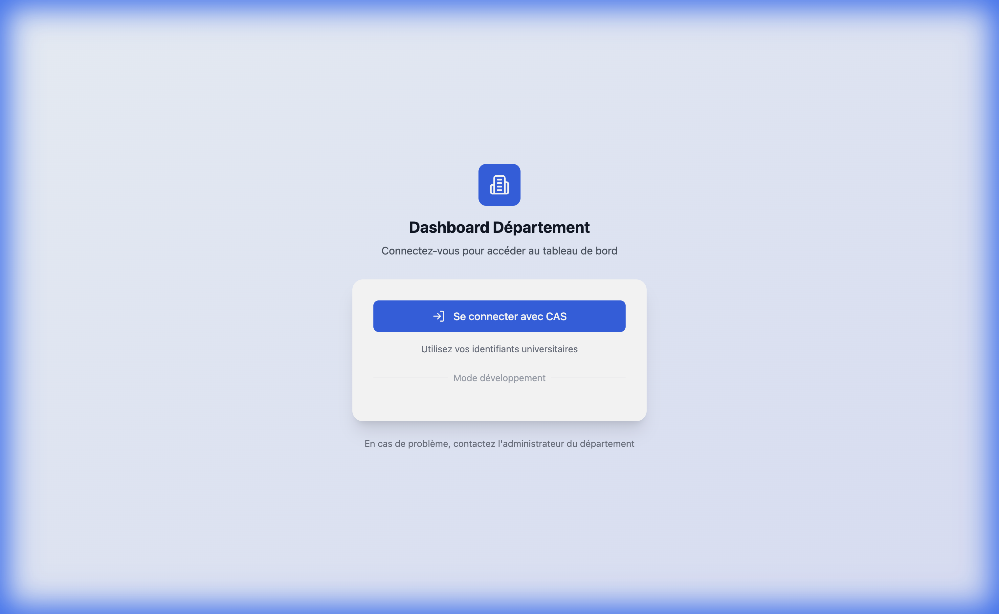
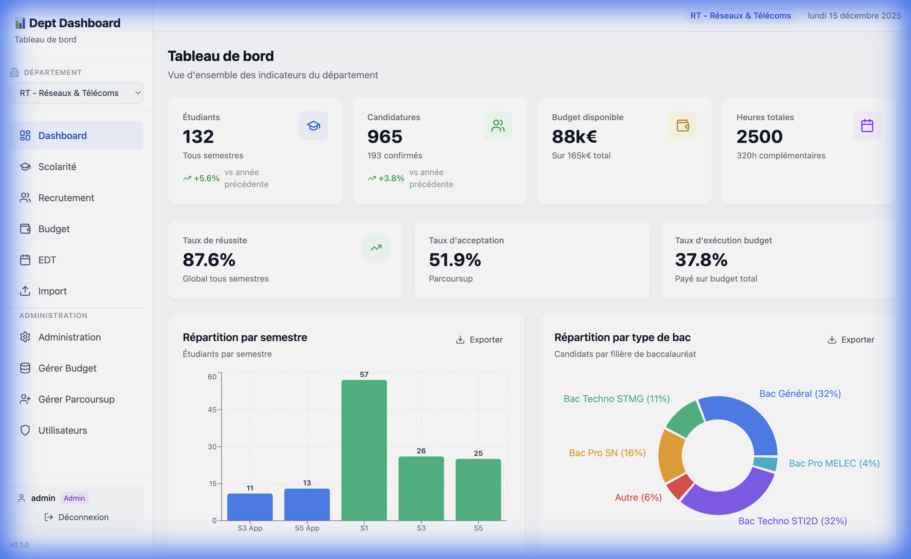
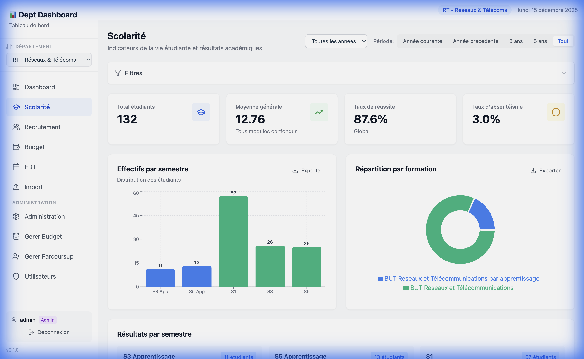
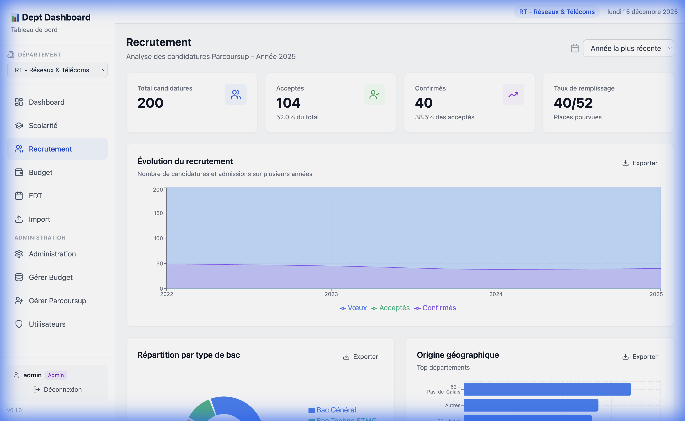
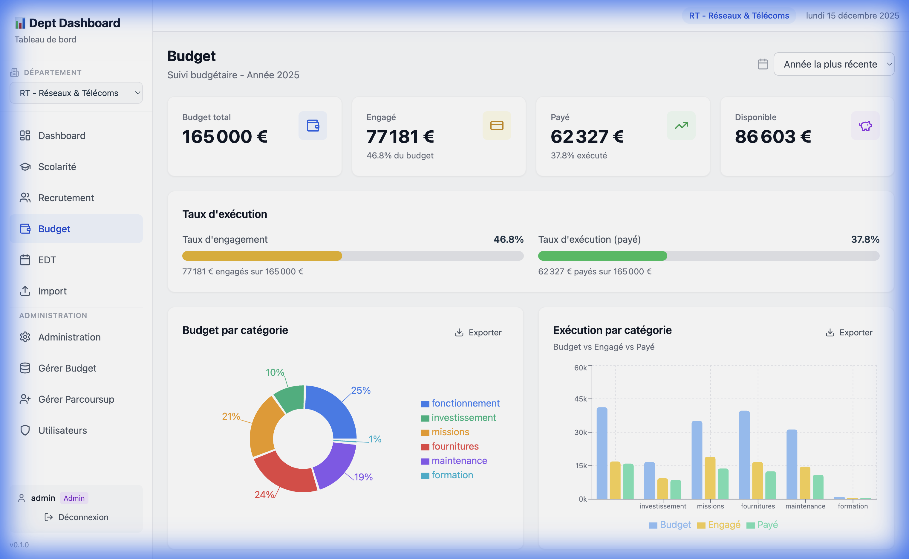
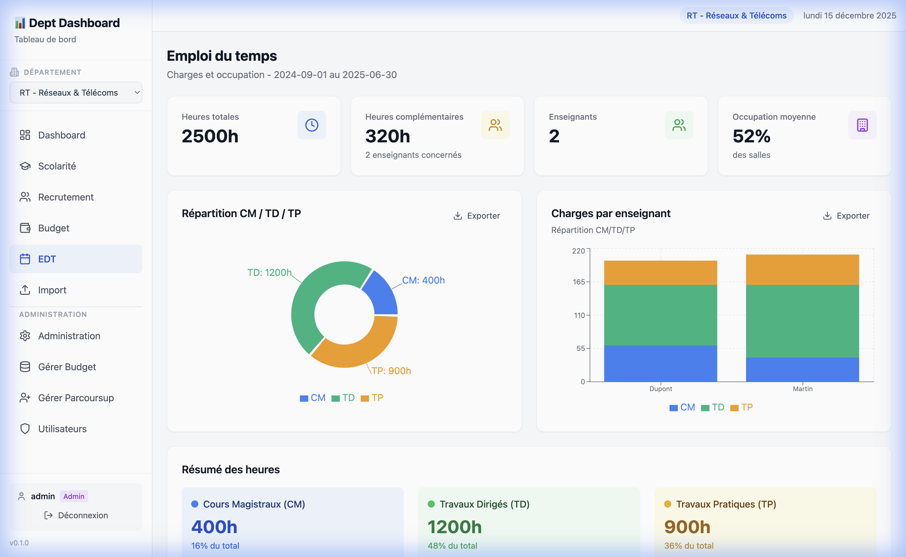
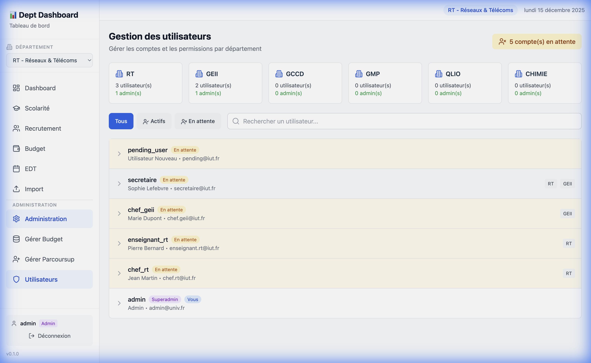
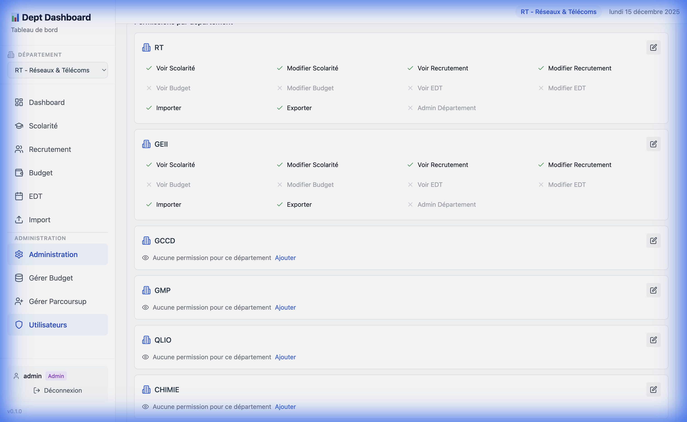
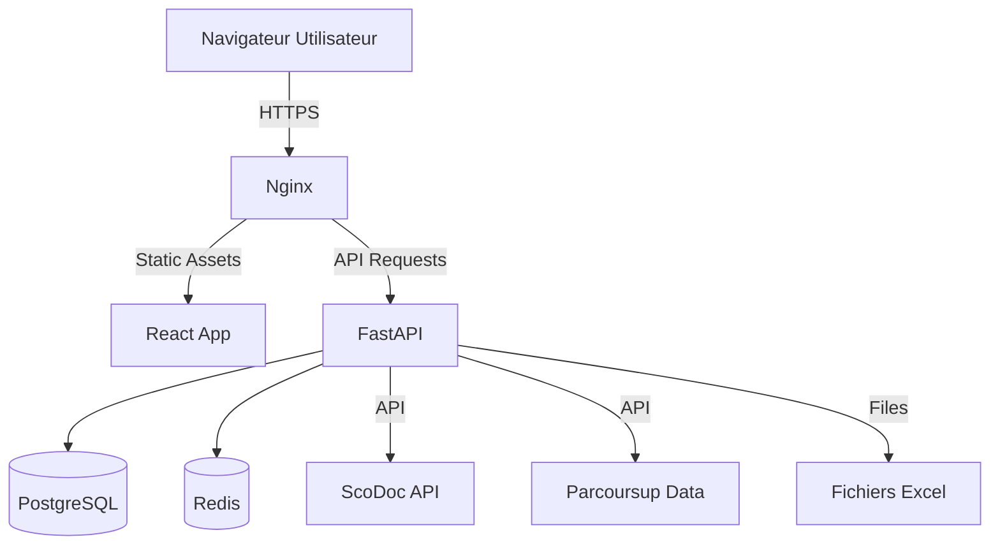

# 📘 Documentation Dept-Dashboard

## 📖 Introduction

Dept-Dashboard est une application web moderne conçue pour centraliser et visualiser les indicateurs clés des départements d'IUT (Institut Universitaire de Technologie). Elle offre une vue d'ensemble sur la scolarité, le recrutement, le budget et les emplois du temps.

Ce document détaille les fonctionnalités, l'interface utilisateur et l'architecture technique du projet.

---

## 📸 Visite Guidée (Walkthrough)

### 1. Connexion
L'accès au tableau de bord est sécurisé. En production, l'authentification se fait via le CAS de l'université. En développement, un mode "dev" permet de se connecter rapidement.



### 2. Tableau de Bord Principal (Dashboard)
Une fois connecté, l'utilisateur arrive sur la vue d'ensemble. Cette page présente des indicateurs synthétiques pour chaque grand domaine : Scolarité, Recrutement, Budget et EDT.



### 3. Module Scolarité
Le module **Scolarité** permet de suivre les effectifs, les résultats et la progression des étudiants. Il s'interface avec ScoDoc pour récupérer les données en temps réel.



**Fonctionnalités clés :**
- Visualisation des effectifs par promotion (BUT1, BUT2, BUT3).
- Suivi des taux de réussite.
- Indicateurs d'assiduité (si disponible).

### 4. Module Recrutement
Le module **Recrutement** offre une analyse des campagnes Parcoursup et eCandidat.



**Fonctionnalités clés :**
- Suivi du remplissage des vœux.
- Origine des candidats (Bac technologique, général, pro).
- Taux de confirmation et d'admission.

### 5. Module Budget
Le module **Budget** permet aux responsables de suivre l'état des finances du département.



**Fonctionnalités clés :**
- Suivi des dépenses par ligne budgétaire.
- Visualisation de la répartition du budget (Investissement vs Fonctionnement).
- Alertes sur les seuils de dépenses.

### 6. Module Emploi du Temps (EDT)
Le module **EDT** analyse la charge d'enseignement et l'occupation des ressources.



**Fonctionnalités clés :**
- Charge horaire par enseignant.
- Taux d'occupation des salles.
- Répartition CM/TD/TP.

---

### 7. Gestion des Utilisateurs et Permissions
Le module **Administration** permet aux administrateurs de gérer les accès et les droits des utilisateurs.



#### Détail des Permissions
En cliquant sur un utilisateur, vous accédez au panneau de configuration détaillé.



Pour chaque département, vous pouvez cocher les droits spécifiques :
- **Voir / Modifier Scolarité** : Accès aux notes et jurys.
- **Voir / Modifier Recrutement** : Accès aux dossiers Parcoursup.
- **Voir / Modifier Budget** : Accès au suivi financier.
- **Voir / Modifier EDT** : Accès aux emplois du temps profs/salles.
- **Import / Export** : Droit d'importer des fichiers Excel ou d'exporter les statistiques.

Le badge <span style="background-color: #dcfce7; color: #166534; padding: 2px 6px; border-radius: 4px; font-size: 0.8em;">Admin</span> donne tous les droits sur le département concerné.

---

## 🏗️ Architecture Technique

Le projet repose sur une architecture moderne séparant le frontend et le backend, conteneurisée avec Docker.

### Stack Technique

- **Frontend** : React, TypeScript, Vite, TailwindCSS.
- **Backend** : Python, FastAPI, SQLAlchemy, Pydantic.
- **Base de Données** : PostgreSQL.
- **Cache** : Redis.
- **Reverse Proxy** : Nginx.

### Schéma Simplifié



---

## 🚀 Installation et Démarrage

Pour une installation complète, référez-vous au fichier [DEPLOY.md](DEPLOY.md).

### Resumé pour le Développement

1.  **Cloner le dépôt**
    ```bash
    git clone https://github.com/votre-repo/dept-dashboard.git
    cd Dept-Dashboard
    ```

2.  **Lancer avec Docker Compose**
    ```bash
    docker compose -f docker-compose.prod.yml --env-file .env.prod up -d --build
    ```

3.  **Accéder à l'application**
    - Frontend : `https://localhost`
    - API Docs : `https://localhost/api/docs`

---

## 🤝 Contribution

Les contributions sont les bienvenues. Veuillez consulter `AGENTS.md` pour les détails sur les conventions de code et les workflows.
