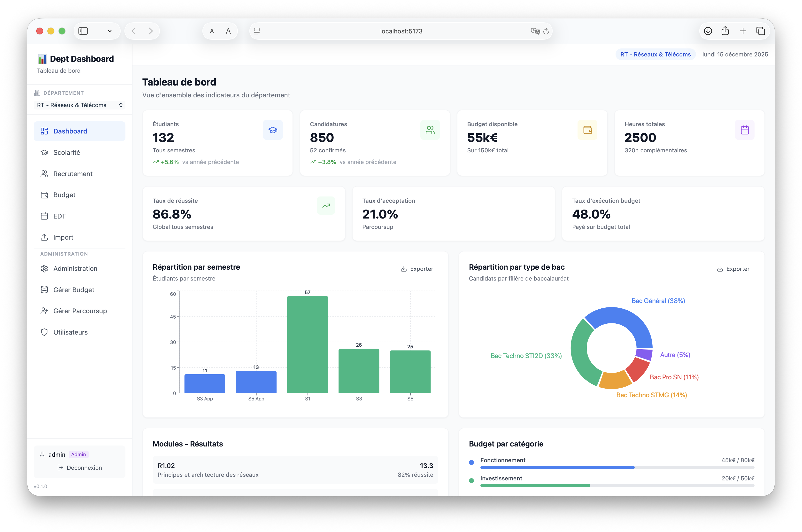

<div align="center">

# 🎓 Dept-Dashboard

**Tableau de bord moderne pour les départements d'IUT**

*Visualisez vos données de scolarité, recrutement et budget en un coup d'œil*

[](https://fastapi.tiangolo.com/)
[](https://react.dev/)
[](https://www.typescriptlang.org/)
[](https://tailwindcss.com/)

</div>

---



## ✨ Fonctionnalités

| Module | Description |
|--------|-------------|
| 📊 **Scolarité** | Effectifs, taux de réussite, notes par semestre via ScoDoc |
| 🎯 **Recrutement** | Statistiques Parcoursup, profils des candidats admis |
| 💰 **Budget** | Suivi des dépenses, répartition par catégorie |
| 📅 **EDT et Maquettes** | Charges enseignantes, occupation des salles, maquettes pédagogiques |
| 🔐 **Multi-départements** | Authentification CAS, permissions granulaires |

Plus de détails sur les fonctionnalités dans le [DOCUMENTATION.md](DOCUMENTATION.md).

## 🚀 Démarrage rapide

### Mode développement (API + Front séparés)

```bash
# Cloner le projet
git clone https://github.com/votre-repo/dept-dashboard.git
cd Dept-Dashboard

# Backend
python -m venv backend/venv
source backend/venv/bin/activate
pip install -r backend/requirements.txt
docker compose up -d redis  # cache local
cd backend
alembic upgrade head        # si DATABASE_URL est défini (PostgreSQL)
python -m app.seeds --force # données de démo (optionnel)
uvicorn app.main:app --app-dir backend --reload --port 8000

# Frontend (nouveau terminal)
cd frontend
npm install
npm run dev -- --host --port 5173
```

### Mode Docker (stack complète)

```bash
docker compose -f docker-compose.prod.yml --env-file .env.prod up -d --build
```

| Service | Dev local | Docker |
|---------|-----------|--------|
| 🖥️ Frontend | http://localhost:5173 | http://localhost:3000 |
| ⚡ API | http://localhost:8000 | http://localhost:8000 |
| 📚 Documentation | http://localhost:8000/docs | http://localhost:8000/docs |

> Les routes API sont scindées par département : `/api/{department}/...` (ex : `/api/RT/scolarite/indicators`).

## 🛠️ Stack technique

```
Frontend (React/Vite/TS) → FastAPI Backend → Adapters → Sources de données
                               ↓
                    PostgreSQL + Redis (cache)
```

| Couche | Technologies |
|--------|-------------|
| **Frontend** | React 18, TypeScript, Vite, Tailwind CSS, Recharts |
| **Backend** | FastAPI, Python 3.11+, Pydantic v2, SQLAlchemy |
| **Base de données** | PostgreSQL (prod) / SQLite (dev) |
| **Cache** | Redis 7 |

## 📁 Structure

```
├── backend/           # API FastAPI
│   ├── app/
│   │   ├── api/       # Routes & authentification
│   │   ├── adapters/  # Connecteurs (ScoDoc, Parcoursup, Excel)
│   │   └── models/    # Modèles Pydantic & SQLAlchemy
│   └── alembic/       # Migrations DB
├── frontend/          # Application React
│   └── src/
│       ├── pages/     # Pages du dashboard
│       └── components/
└── docker-compose.yml
```

## 🔧 Configuration

```bash
cp .env.prod.example .env
# En dev, conserver DEBUG=true et CAS_USE_MOCK=true pour éviter le SSO réel
```

```env
DEBUG=true
SECRET_KEY=change-me
CAS_USE_MOCK=true
CAS_SERVER_URL=https://sso.univ-artois.fr/cas
CAS_SERVICE_URL=http://localhost:8000/api/auth/cas/callback
FRONTEND_URL=http://localhost:5173
REDIS_URL=redis://localhost:6379
DATABASE_URL=                 # vide => SQLite backend/app/data/dashboard.db
SCODOC_BASE_URL=              # optionnel : API réelle
SCODOC_USERNAME=
SCODOC_PASSWORD=
SCODOC_DEPARTMENT=RT
```

La base SQLite est créée automatiquement si `DATABASE_URL` est vide. Activez PostgreSQL en renseignant `DATABASE_URL` puis en exécutant `alembic upgrade head`.

## 🧪 Tests

```bash
cd backend
pytest
```

## 📖 Documentation

- 📘 [Guide de déploiement](DEPLOY.md)
- 📗 [Documentation technique](AGENTS.md)
- 📙 [Plan du projet](plan.md)

## 📄 Licence

MIT © 2025
